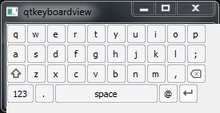
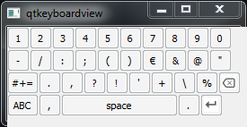
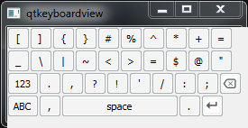
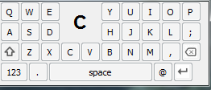

# qtwidgetvirtualkeyboard
Qt Widget Virtual Keyboard

This widget provide a widget of a IOS Keyboard Like.
When the user click one a virtual key an other window appear with the letter pressed.

Compatible QT5 and QT4 

